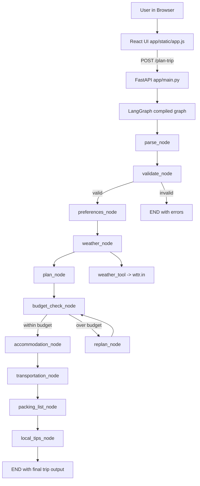

# Trip Planner Architecture

## 1. System Overview

This application is a single-repo AI trip planner with:
- FastAPI backend serving both API and static UI assets
- React frontend (no separate Node build)
- LangGraph workflow orchestrating multiple AI and utility nodes
- Groq LLM for parsing and generation tasks
- wttr.in weather integration for forecast context

## 2. Architecture Diagram

## 3. Request Lifecycle

1. User enters natural language trip request in the UI.
2. Frontend sends message to POST /plan-trip.
3. FastAPI creates initial state with user_input.
4. LangGraph runs nodes in sequence with conditional branching.
5. Output is returned as JSON and rendered section-by-section in UI.

## 4. Core Components

### 4.1 FastAPI Layer
- Entry point: app/main.py
- Routes:
  - GET /
  - POST /plan-trip
  - GET /api
  - GET /health
- Also serves static files from app/static.

### 4.2 State Contract
- Shared state type: app/agent/state.py
- Carries parsed fields, generated outputs, flags, and errors.
- Important fields: destination, budget, currency, duration, start_date, end_date, plan, estimated_cost, is_valid, errors.

### 4.3 LangGraph Orchestration
- Graph definition: app/agent/graph.py
- Conditional checkpoints:
  - validate_node can stop workflow when input is invalid
  - budget_check_node can loop into replan_node for optimization

### 4.4 AI + Tooling Nodes
- parse_node: extracts structured fields from natural language
- preferences_node: infers interests
- weather_node: enriches context via weather_tool
- plan_node: creates day-by-day itinerary
- budget_check_node: estimates total cost vs budget
- replan_node: revises plan if over budget
- accommodation_node: lodging recommendations
- transportation_node: travel options
- packing_list_node: checklist items
- local_tips_node: destination tips

## 5. Error Handling Strategy

- Node-level try/except in each node to avoid full request crashes.
- Parse/auth errors are attached to errors in state.
- Validation can short-circuit the graph for critical issues.
- Retry with exponential backoff in several generation nodes for rate-limit resilience.
- Fallback responses in some nodes preserve demo continuity.

## 6. Design Decisions

- LangGraph chosen for explicit multi-step control and branching.
- Static React served by FastAPI to keep deployment simple.
- LLM output forced into JSON shape to reduce parsing ambiguity.
- Currency now propagated via shared state to avoid USD-only prompts.

## 7. Current Limits

- Strong dependency on valid Groq API credentials.
- LLM-only parsing mode means parse failures can block downstream quality.
- Cost estimates are heuristic LLM outputs, not live pricing APIs.
